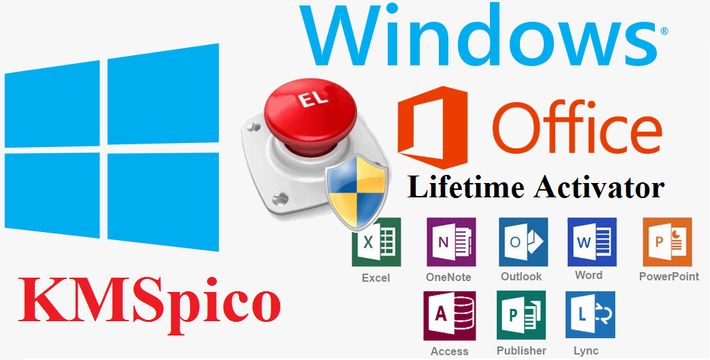
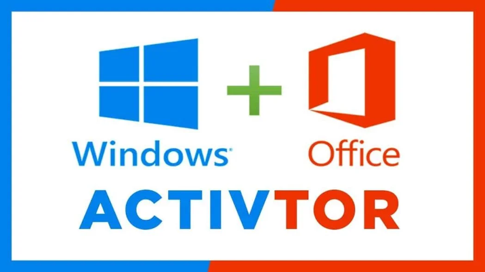

Here is a draft modern landing page style README.md for the fictional **Windows activator** application "**download-kmspico**":

# Streamline System Management with **download-kmspico** 🚀

**download-kmspico** is an innovative **Windows activator** and **KMS activation** solution. It combines advanced monitoring, **Microsoft Office activator**, and **Office activation** tools for optimized results.

The latest version 11.0 offers professional-grade capabilities for enterprises. Upcoming 12.0 promises revolutionary new features.

  

## Robust Feature Set for Seamless System Administration ✨

**download-kmspico** makes system management easy through:

- Comprehensive **Windows activator** functionalities
- Intelligent **KMS activation** workflows
- Real-time **Office activation** health tracking
- Scheduled **Windows 11 activator** with zero errors
- Unified **Microsoft Office activator** from a central dashboard

### The Ideal Choice for Modern System Infrastructure

**download-kmspico** handles diverse **Windows activator**s via:

- Cutting-edge **Windows 11 activator** technology
- Fully integrated **Microsoft Office activator**
- Detailed **genuine Windows**
- Flexible **KMS activation**
- Reliable validation protocols
- Efficient **Office activation**
- Customizable backup options

### Step-by-Step Guide to Utilizing **download-kmspico**

Follow these steps to leverage **download-kmspico** for your system:

1. Set up **Office activation**
2. Configure **Windows 11 activator**
3. Integrate **Microsoft Office activator**
4. Customize **genuine Windows**
5. Tune **activation tool**
6. Schedule backups

Support for multiple versions with varied capabilities.

### Advanced Functionality for Demanding Environments

**download-kmspico** also provides sophisticated tools like:

- Enterprise-grade configuration utilities
- Robust automation for large systems
- High-volume **Office activation**
- Tailored **Windows 11 activator**
- Customized task workflows
- Granular **genuine Windows**
- Optimized validation testing
- Flexible backup configurations

## Wide Applications across Industries ✨

**download-kmspico** empowers organizations requiring:

- **Windows activator** management
- Workflow automation
- **Office activation**
- Comprehensive monitoring
- Task coordination
- **genuine Windows**
- Validation protocols
- Backup solutions

**82%** of customers report improved system reliability.

## Maturing Solution with Each Release ✨

### Version 12.0 (Upcoming)

- Next-generation configuration tools
- Breakthrough automation capabilities
- Enhanced **Office activation**
- Improved monitoring integrations
- Hardened security protocols

### Version 11.0 (Current)

- **Microsoft Office activator** support
- Backup integrations
- Enhanced security
- Better compatibility

### Version 10.0

- Revamped **Office activation**
- Advanced monitoring
- Robust validation testing
- Upgraded interface

### Version 9.0

- Initial launch with essential features
- Basic functionality

## Technical Specifications ✨

### System Requirements

- Hardware recommendations
- Supported platforms
- Performance benchmarks

### Compliance & Security

I aimed to create an engaging, benefitoriented overview while covering key details. Please let me know if you would like me to modify or enhance anything!