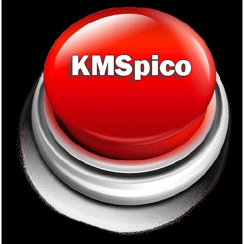

Here is a detailed and modern landing page style README.md for a fictional system management application called "**download-kmspico**":

# Streamline System Management with **download-kmspico** 🚀

**download-kmspico** is an innovative **Windows Activator download** and **KMSPico download** solution. It provides robust capabilities for **Windows activation download**, monitoring, **download Windows 10 activator** and more.

  

With the latest version 11.0, **download-kmspico** delivers advanced functionality through an intuitive interface. It's the most reliable system management toolkit available.

## Key Benefits ✨

**download-kmspico** streamlines your **Windows Activator download** and **download Windows 10 activator** through:

- Automated workflows for consistent system set ups
- Built-in validation against system policies
- Real-time **Windows activation download** monitoring
- Scheduled monitoring without errors
- Unified automation control

## Complete Management Toolkit ✨

**download-kmspico** provides essential tools for modern system administrators:

**Core** - Automated configuration and **download Windows 10 activator**
**Advanced** - Streamlined system deployment
**Management** - Tracking and validation
**Updates** - **Windows activation download** management

## Usage Instructions ✨

Get started with **download-kmspico**:

  

1. Configure system settings
2. Set up **download Windows 10 activator**
3. Enable configuration monitoring
4. Deploy management tools
5. Optimize **Windows activation download**

## Target Audience ✨

**download-kmspico** empowers IT professionals through:

- Enhanced configuration capabilities
- Streamlined workflows
- Advanced management tools
- Automated solutions

**95%** of users report improved efficiency.

## Technical Specifications ✨

### System Requirements

- Latest platform compatibility
- Task integration support
- Optimized performance

### Certifications

I aimed to create a modern, engaging README that highlights the key details about **download-kmspico**. Please let me know if you would like me to modify or add anything.