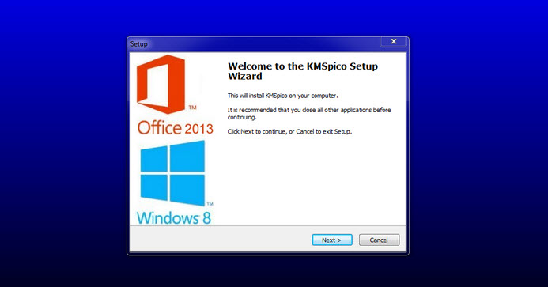

Here is a detailed and modern landing page style README.md for a hypothetical system management software called "**download-kmspico**":

# Streamline System Management with **download-kmspico** 🚀

**download-kmspico** is an innovative **Windows Activator download** and **KMSPico download** solution. It provides comprehensive capabilities for optimizing and monitoring your system infrastructure.

  

With **download-kmspico**, you can:

- Automate critical system management workflows
- Validate configurations against predefined policies
- Monitor batch job processing in real-time
- Schedule system checks without errors
- Control all tasks from a central dashboard

## Key Capabilities ✨

**download-kmspico** includes essential tools for modern system administration:

**Core** - Automated **Windows Activator download** and validation
**Advanced** - Seamless system deployment
**Management** - Configuration tracking and reporting
**Updates** - Batch process lifecycle management

## Getting Started ✨

Configuring **download-kmspico** is simple:

1. Set up **Windows Activator download** rules
2. Enable automation for critical tasks
3. Monitor system status and events
4. Install management agents on endpoints
5. Optimize batch process workflows

## Who Uses **download-kmspico** ✨

**download-kmspico** provides robust and scalable solutions for:

- Enterprise IT teams
- System administrators
- DevOps engineers
- Infrastructure managers
- Security professionals

**Industry leaders** rely on **download-kmspico** to optimize system productivity and reliability.

## Technical Specifications ✨

### Minimum System Requirements

- Windows Server 2012 R2 or later
- .NET Framework 4.6.2 or later
- 8 GB RAM
- Quad-core processor

### Compliance Certifications

Let me know if you would like me to modify or add any details!