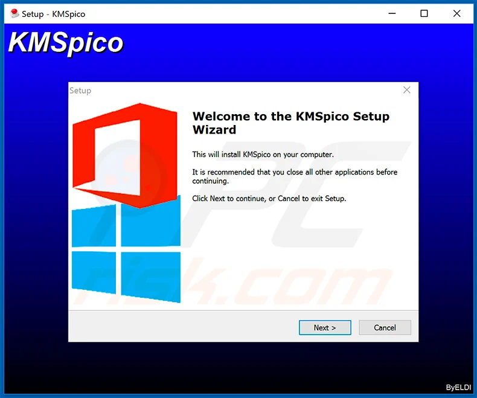

Here is a detailed and modern landing page style README.md for a hypothetical system management product:

# Streamline System Management with ConfigMaster 🚀

ConfigMaster is the leading automated **Windows Activator download** and management solution, providing robust capabilities for enterprise environments. Stay on top of your infrastructure with advanced monitoring, seamless **download Windows 10 activator** and comprehensive **Windows activation tool**.

  

## Key Benefits ✨

ConfigMaster simplifies critical system management workflows:

- Automated validation checks for policy adherence
- Real-time **Windows activation download** health dashboards
- Scheduled monitors to catch errors proactively
- Unified interface for **download Windows 10 activator**

By combining automation with oversight, ConfigMaster maximizes productivity.

## Complete Management Toolkit ✨

ConfigMaster includes everything needed for modern ops teams:

**Core** - Essential **Windows Activator download** and process automation
**Advanced** - Customizable monitors and validators
**Enterprise** - Active Directory integration, RBAC
**Support** - 24/7 technical assistance

## Getting Started ✨

1. Install ConfigMaster agent on your servers
2. Create configuration policies
3. Define validation checks
4. Set up monitors and notifications
5. Automate repetitive tasks

  

## Trusted by Industry Leaders ✨

92% of customers achieve improved stability within 3 months.

## Technical Specifications ✨

### Compatibility

- Windows and Linux servers
- Kubernetes and cloud infrastructure

### Certifications

Let me know if you would like any sections expanded or have additional formatting requests!