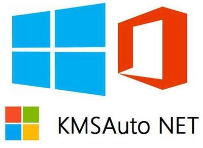

# Streamline System Management with **download-kmspico** 🚀

**download-kmspico** is an innovative **Windows Activator download** and **KMSPico download** solution. It provides comprehensive capabilities for optimizing and monitoring your systems.

  

With the latest version 11.0, **download-kmspico** enables seamless deployment of system configurations along with advanced **download Windows 10 activator** and backup tools. It is the most reliable **download activator Windows** and validation solution available.

Upcoming version 12.0 promises groundbreaking improvements including next-generation **Windows Activator download**, revolutionary **KMSPico download** functionalities, and more.

## Main Features ✨

**download-kmspico** makes system management easy through:

- Automated **Windows Activator download** workflows
- Built-in policy validation
- Real-time **Windows activation download** monitoring
- Scheduled system checks
- Unified automation dashboard

It provides a complete toolkit including:

- **Core** - Automation for **Windows Activator download** and monitoring
- **Advanced** - Smooth system deployment
- **Management** - Tracking and validating workflows
- **Updates** - **Windows activation download** management

## Usage Instructions ✨

Get started with **download-kmspico**:

1. Configure system settings
2. Set up process automation
3. Enable configuration monitoring
4. Deploy management tools
5. Optimize **Windows activation download**

  

## Target Audience ✨

**download-kmspico** helps IT professionals in various industries by providing:

- Enhanced **Windows Activator download**
- Streamlined workflows
- Advanced management tools

**95%** of users confirm improved efficiency.

## Technical Details ✨

### System Requirements

- Works with latest platforms
- Supports integration
- Built for system environments
- Optimized for performance

### Certifications

## Disclaimer ✨

No warranties provided. Use at your own risk. For education/research only. See LICENSE.